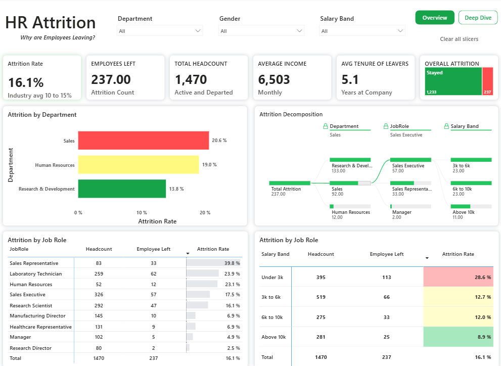
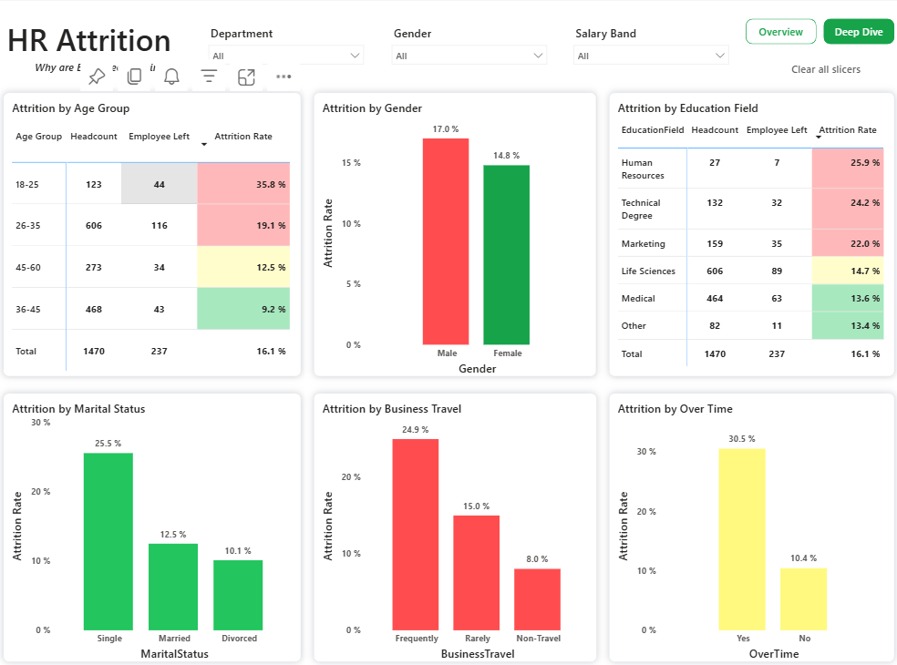

# 📊 HR Analytics Dashboard
### Overview  

### Deep Dive  

### Live Power BI Report: (https://app.powerbi.com/links/ysEjRmAl9z?ctid=2bb44e71-1601-4af2-a592-4224ddcfb1c3&pbi_source=linkShare)

## 📖 Project Overview
End-to-end HR analytics solution built on Power BI and Microsoft Fabric — with enterprise-grade column-level security on sensitive compensation data. 

## 🎯 Business Problem

Every company loses people. Few can tell you who, from where, and why fast enough to act on it — and fewer still can do that without exposing sensitive compensation data to everyone who opens the report.

This project simulates that gap — an HR analytics dashboard that lets a business/HR stakeholder go from "attrition feels high" to "attrition is highest among overtime employees in Sales, in the ₹[X] salary band" in under 3 clicks, with zero SQL knowledge required — while ensuring only authorized roles can see individual compensation figures.

The semantic model is hosted and managed in Microsoft Fabric, with the Power BI report connected live to it — the same setup used in enterprise environments where the data model, security, and reporting layers are deliberately separated.
## 🛠️ Tech Stack

- Power BI
- SQL
- Microsoft Fabric
- DAX
- Power Query

## 📂 Dataset

### Dataset Used: IBM HR Dataset 

## 📄 Dashboard Pages

### Page 1 — Executive Overview

| Component | Purpose |
|-----------|---------|
| KPI Cards | Monitor key HR metrics |
| Treemap | Attrition distribution |
| Decomposition Tree | Root cause analysis |
| Bar Chart | Department-wise attrition |
| Pivot Tables | Education & Age insights |
| Slicers | Interactive filtering |

### Page 2 — Deep Dive

| Component | Purpose |
|-----------|---------|
| 4 Bar Charts | Employee segmentation analysis |
| Pivot Tables | Detailed HR breakdowns |
| Navigation | Back to overview |

## 📐 Data Model

| Field | Type | Description |
|-------|------|-------------|
| Department, Job Role, Salary Band | Dimension | Organizational segmentation |
| OverTime, Business Travel, Marital Status, Gender, Education Field | Dimension | Behavioral and demographic segmentation |
| Age Group | Dimension (Binned) | Age grouped into buckets for readability |
| Headcount | Measure | `COUNTD` distinct employees |
| Employees Left / Employees Stayed | Measure | Attrition flag aggregation |
| Attrition Rate | Measure | Employees Left ÷ Headcount |
| Avg Monthly Income | Measure | Average monthly compensation |
| Avg Tenure of Leavers | Measure | Average tenure calculated for employees who left |

## 📈 Key Insights

- 📌 Overall Attrition Rate: **16.1%**
- 📌 Sales department recorded the highest attrition.
- 📌 Employees working overtime are more likely to leave.
- 📌 Lower monthly income is associated with higher attrition.
- 📌 Business Travel has a measurable impact on attrition.

## 💼 Business Recommendations

- Improve retention programs for high-risk employee groups.
- Review overtime policies.
- Monitor attrition by department through monthly KPI dashboards.
- Strengthen engagement initiatives for employees with frequent business travel.

## 🔒 Data Security — Column-Level Security (CLS)

Avg Monthly Income / MonthlyIncome is sensitive compensation data — in a real HR setting, not every viewer of this dashboard should see it. 
To reflect that, I implemented column-level security on the MonthlyIncome column in the Fabric/Power BI semantic model:

- Defined security roles in the semantic model (Model view → Manage Roles) restricting access to the MonthlyIncome column for non-authorized roles.
- Users assigned to a restricted role can still see all attrition metrics, department breakdowns, and headcount — but the compensation figure is hidden/blank for them, while HR/Admin roles retain full visibility.
- This demonstrates role-based access control (RBAC) at the semantic-model layer, separate from row-level filtering — a distinction most fresher-level BI portfolios skip entirely.

### Column Level Security(CLS) 

### Member Roles  
                                                                                                          

## 👤 Author

**Utkarsh Gupta**

- LinkedIn: https://www.linkedin.com/in/utkarsh85/
- GitHub: https://github.com/utkarsh2387
